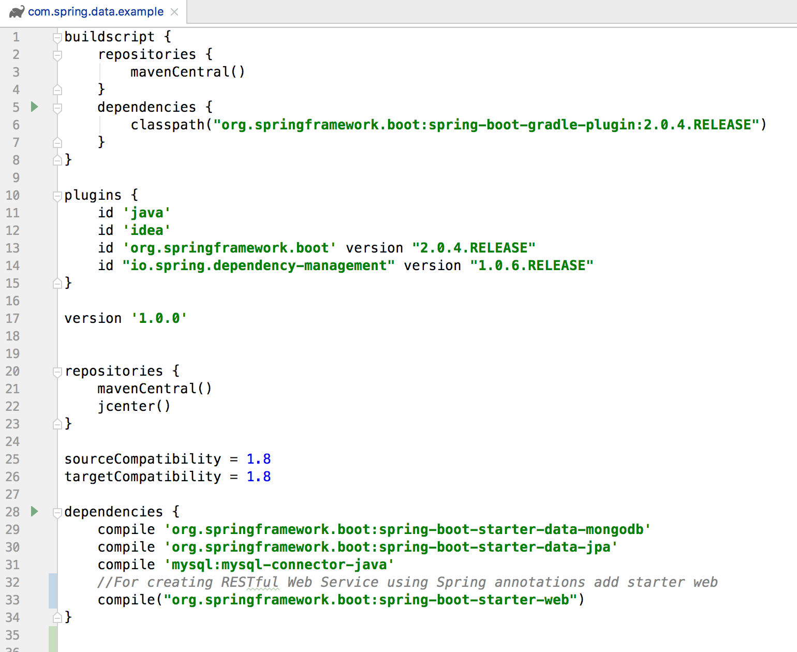
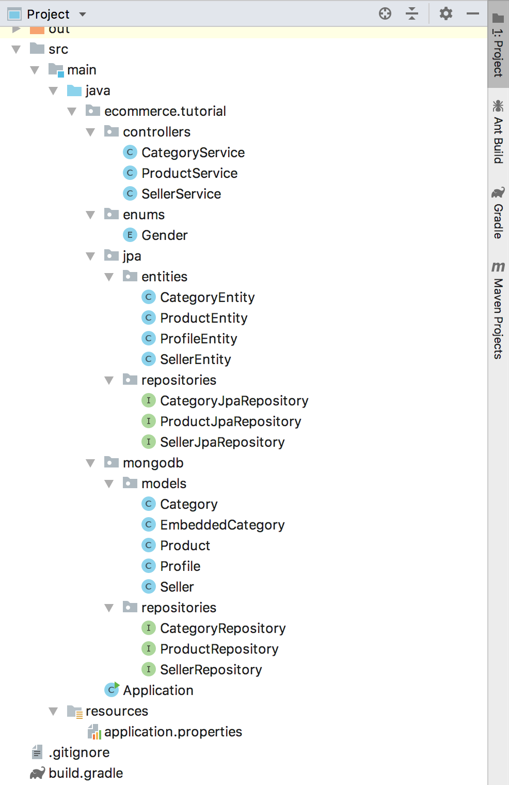
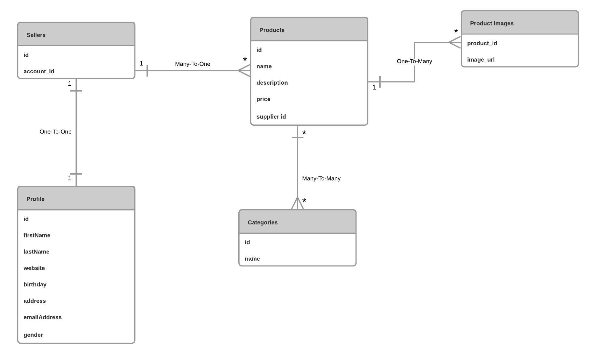
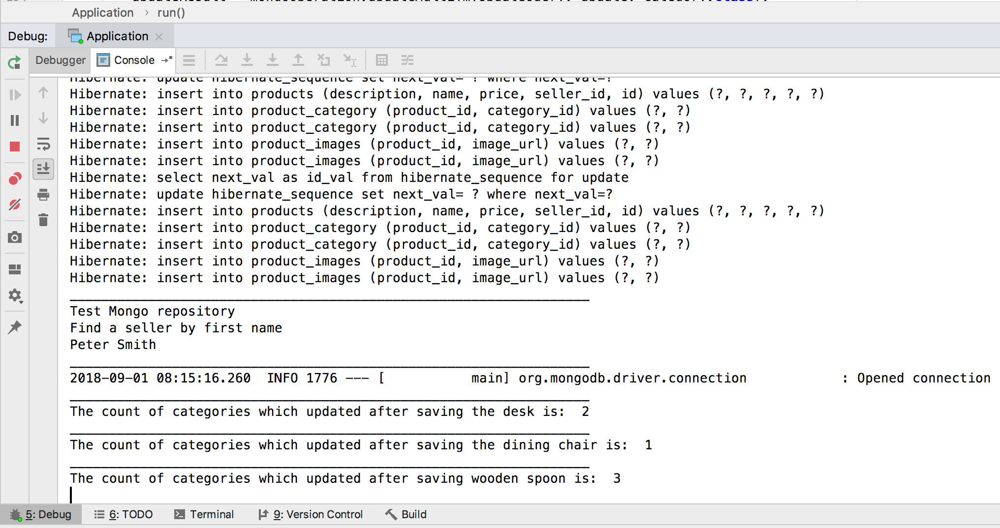
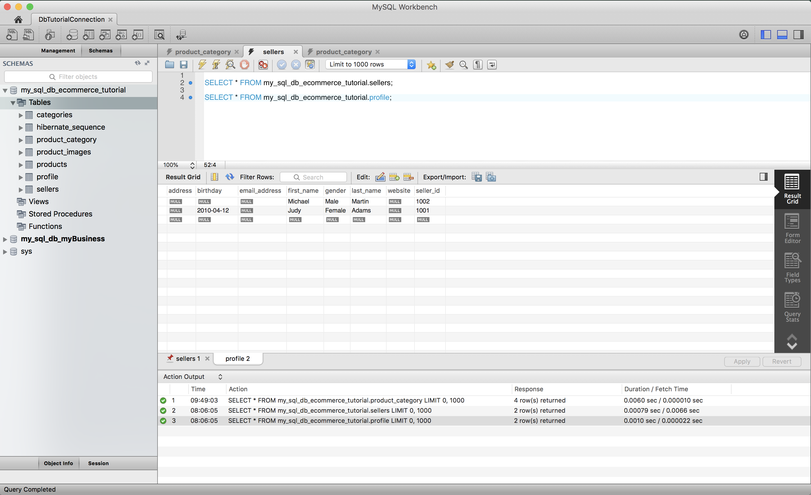
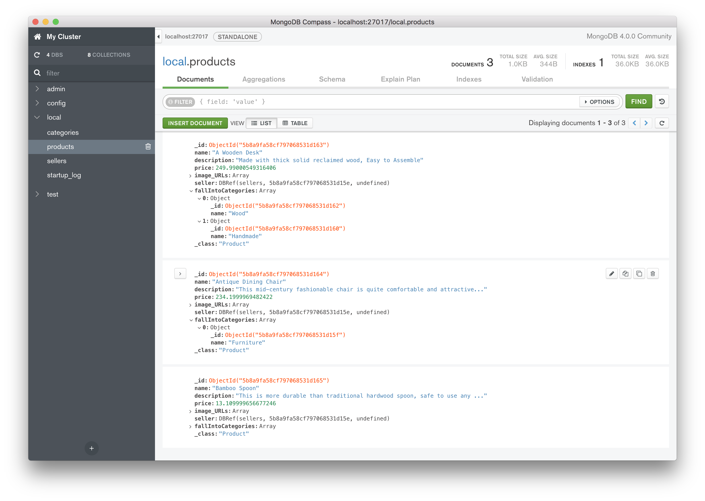
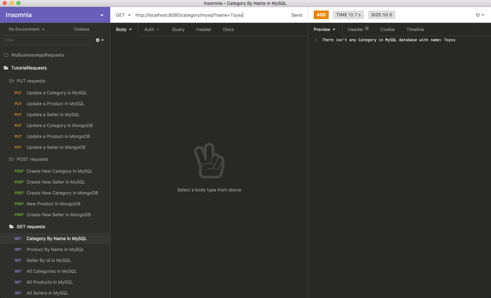
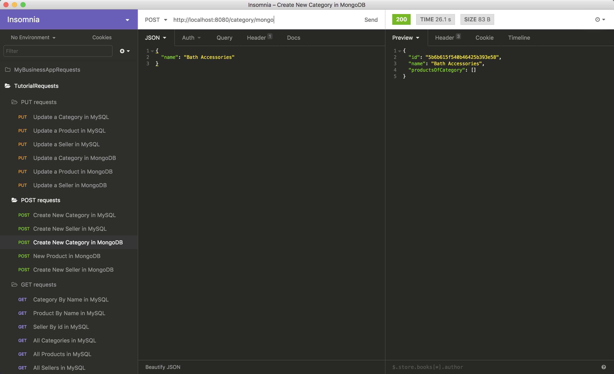

# 1. Introduction
In this tutorial we will show how to model different kinds of relationships between data domains using Spring Data JPA and Spring Data MongoDB.

We consider a simple data model for an e-commerce application and create database schemas for both MongoDB and MySQL databases. Then we create three RESTful services to test the databases. We will run our application with Spring Boot and Gradle.

MongoDB is a NoSQL technology which stores the data in JSON-like structured documents. As we all know document-based databases have fundamental differences to relational databases. In this tutorial we design the MongoDB schema the same as the MySQL schema for the purpose of showing the differences.
So you may have better choices in modeling relationships when designing your database schemas.

# 2. Requirements
The technologies used in this tutorial are as follows:
* Spring Boot 2.0.4
* Spring Data JPA 2.0.9
* Spring Data MongoDB 2.0.9
* MongoDB 4.0.0
* Gradle 4.8.1
* Java 1.8.0_172
* Insomnia 6.0.2
* MongoDB Compass 1.14.6

# 3. Project Dependencies
The build.gradle file in our project includes dependencies for Spring Boot Starter Web, Spring Data MongoDB and Spring Data JPA. You can use Spring Initializer to start your Spring Boot application. This is a web tool Spring provides to bootstrap an application quickly. You’ll download the project file and then can open it in IDEA. Access the Spring Initializer at [SPRINGINITIALIZER](https://start.spring.io).

The build.gradle file will look as shown below.



# 4. Project Structure
Create the folders we'll need for implementing project. We'll have four folders inside 'ecommerce.tutorial' package.

*`Controllers` folder*: We put our RESTful services in this folder.

*`Enums` folder*: We put our enumeration classes in this folder.

*`mongodb` folder*: We put models and repositories for the MongoDB database in this folder.

Add a `resources` package and create an `application.properties` file in this package. We'll write the configuration for our databases here in the next sections.

Add an `Application.java` file inside the `com.wissen.mandihub` package.



# 5. A Sample Data Model for the Project
Suppose we have a simple e-commerce app which includes Sellers and their Products. We’ll consider these scenarios:

A Seller has a Profile (suppose we’d like to store sellers’ information separately because the Profile will have a relation with another class).

A Seller has some Products for selling.

All Products are organized in Categories.

A Product can fall into one or more Categories.

Each Category has some Products.



# 7. MongoDB
##  a. Install MongoDB and create a new database
We can use homebrew to install MongoDB on Mac as follows:

Install MongoDB: `brew install mongodb`

Create a directory: `mkdir ~/data/db`

Set permissions for the directory: `sudo rm -rf ~/data/db/`

Run MongoDB: `mongod --dbpath ~/data/db`

Start a mongo shell: `mongo --host 127.0.0.1:27017`

For further details see [Install MongoDB Community Edition](https://docs.mongodb.com/manual/tutorial/install-mongodb-on-os-x/).

##  b. MongoDB Configuration in 'application.properties'
In the `application.properties` file in your project, add the following configuration:

```
spring.data.mongodb.uri=mongodb://localhost:27017/local
spring.data.mongodb.port=27017
```
##  c. Create Data Domains using Spring Data MongoDB
Now create the first data domain for our MongoDB database called `Category`. Create a new package called `models` inside `ecommerce.tutorial.mongodb` and add a class named `Category`.
Again, we have two fields for the `Category` model:
 - `id`: The primary key for the `Category` collection.
 - `name`: The name of the `Category`.

```Java
@Document(collection = "categories")
@TypeAlias(value = "Category")
public class Category implements Serializable
{
    @Id
    private String id;

    private String name;

    @DBRef(lazy = true)
    private List<Product> productsOfCategory = new ArrayList<>();

    public Category()
    {
    }

    public Category(String name)
    {
        this.name = name;
    }
```

All of our domain models must be annotated with `@Document` annotation.

Like JPA, all of the data models will have a no-argument constructor. The default constructor only exists for the sake of Spring Data modules.

The collection element of the `@Document` annotation specifies the name of this object in the database. For example, our `Category` object will be saved in a collection called `categories`.

The `@TypeAlias` annotation allows string-based type aliases to be used when writing type information for persistent models in the database.

Notice the primary key for MongoDB documents are `String` (If you need a long id in your application, you should create and handle it manually in your code).

The `@Indexed` annotation enables MongoDB's indexing feature. Setting the `unique` element to `true`, tells the Spring Data mapping framework to mark the `name` field of `Category` as a unique index. A unique index ensures that the indexed fields do not store duplicate values as well as making searches faster (by default, MongoDB creates a unique index on the `id` field during the creation of a collection).

Create `Product` inside the `models` package with following content:
```Java
@Document(collection = "products")
@TypeAlias("Product")
public class Product
{
    @Id
    private String id;

    private String name;

    private String description;

    private float price;

    private List<String> image_URLs = new ArrayList<>();

    @DBRef
    private Seller seller;

    private Set<EmbeddedCategory> fallIntoCategories = new HashSet<>();

    public Product()
    {
    }

    public Product(String name, String description, float price, Seller seller, HashSet<EmbeddedCategory> fallIntoCategories)
    {
        this.name = name;
        this.description = description;
        this.price = price;
        this.seller = seller;
        this.fallIntoCategories = fallIntoCategories;
    }
```

Create `Seller` inside the `models` package with following content:
```Java
@Document(collection = "sellers")
@TypeAlias(value = "Seller")
public class Seller
{
    @Id
    private String id;

    @Indexed(unique = true)
    private String accountId;

    private Profile profile;

    public Seller()
    {
    }

    public Seller(String accountId, Profile profile)
    {
        this.accountId = accountId;
        this.profile = profile;
    }
```

Create `Profile` inside the `models` package with following content:

```Java
public class Profile
{
    private String firstName;

    private String lastName;

    private String website;

    @DateTimeFormat(iso = DateTimeFormat.ISO.DATE)
    private Date birthday;

    private String address;

    private String emailAddress;

    private Gender gender;

    public Profile()
    {
    }

    public Profile(String firstName, String lastName, Gender gender)
    {
        this.firstName = firstName;
        this.lastName = lastName;
        this.gender = gender;
    }
}
```

The `@DateTimeFormat` declares that the `birthday` property should be formatted as a date with stated pattern (`ISO.DATE`).
Notice that the `Profile` class doesn't have `@Document` annotation because it will be embedded in the `Seller` document as an embedded document.

#### **One-To-Many relationship**
A one-to-many relationship with MongoDB can be implemented as embedded documents or document references (model relationship between documents). Here in our sample data model we have a one-to-many relationship between `Products` and `Product_Images`. We model this relationship with embedded documents.
```Java
private List<String> image_URLs = new ArrayList<>();
```
We embed related data (`Product` and its images) in a single document, so with this design it’s possible to retrieve a `Product` and its images with one query.

#### **Many-To-One relationship**
In MongoDB data modeling one-to-many and many-to-one relationship can be modeled by storing embedded documents or storing a reference in one side of relationship. As stated in [MongoDB documentation](https://docs.mongodb.com/manual/tutorial/model-referenced-one-to-many-relationships-between-documents/#model-one-to-many-relationships-with-document-references), the growth of the relationships determines where to store the reference. We model the relationship between `Product` and `Seller` by storing a reference to the `Seller` in the `Product` document, because we only have to store one `seller` `id` for each `product`.

```Java
@DBRef
private Seller seller;
```

#### **One-To-One relationship**
This type of relationship can also be modeled in two ways using MongoDB (embedding the relationship as a document or storing a link to a document in a separate collection). In our sample data model, a `seller` has a single `profile` which stores information about the `seller` and a `profile` has only one `seller`'s information.
As mentioned before our `Profile` class isn't annotated with `@Document`; it's modeled as an embedded document inside the `Seller` collection.

Here in the code the `Seller` document stores a `Profile` document:
```Java
private Profile profile;
```

#### **Many-To-Many relationship**
Although in relational database modeling a many-to-many relationship is simple - we only need a join table between the two tables which own the relationship - there are several ways to implement many-to-many in MongoDB. Consider this scenario:
Each product falls into a few categories, so we model the relation between `Product` and `Category` with embedded documents.

We want to store the `id` and `name` of a `category` in `Product`'s document. To do this, we create a new class called `EmbeddedCategory` which has two fields, `id` and `name`. We denormalize `Product` documents by embedding the `id` and `name` of `categories`. That way we can retrieve all of the `categories` for a `product` without having to perform a join between `Product` and `Category` in the applicaton. Denormalization enables faster reads at the cost of less consistency. 

Note that the relationship between `Product` and `Category` is not handled by the database and we must manually maintain data consistency after each change. In other words, if a `category` name changes, we must update the `name` field of every corresponding `EmbeddedCategory` in `Products` to ensure consistency.


```Java
private Set<EmbeddedCategory> fallIntoCategories = new HashSet<>();
```

Each `category` has lots of `products`, so we model the relation between `Category` and `Product` by storing references to `Products` in `Category`.

```Java
@DBRef(lazy = true)
private List<Product> productsOfCategory = new ArrayList<>();
```
By setting the `lazy` loading element of the `@DBRef` annotation to `true`, the associated documents of the `products` collection are loaded lazily, on-demand.

##  d. Create the Data Access Layer for MongoDB
Spring Data MongoDB like Spring Data JPA provides implementations for MongoDB repository interfaces. Again, we need three repositories for our data domains. Create a new package called `repositories` inside `ecommerce.tutorial.mongodb` package and add three interfaces called `CategoryRepository`, `ProductRepository` and `SellerRepository`.
It's very important not to use the same names as the JPA repositories, although the packages are in different paths.

The interfaces must extend `MongoRepository` and be typed to the domain class and the `id` type of the domain class.

```Java
import org.springframework.data.mongodb.repository.MongoRepository;

import java.util.Optional;

import Category;

public interface CategoryRepository extends MongoRepository<Category, String>
{
    Category findByName(String categoryName);
}
```
In `CategoryRepository` we add a method called `findByName` which finds a document with the exact `name` of the `category`.

```Java
import org.springframework.data.mongodb.repository.MongoRepository;
import org.springframework.data.mongodb.repository.Query;

import java.util.List;
import java.util.Optional;

import Seller;

public interface SellerRepository extends MongoRepository<Seller, String>
{
    @Query("{'profile.firstName': ?0}")
    List<Seller> findByFirstName(String firstName);
}
```
In `SellerRepository` we add a method `findByFirstName` which looks up `firstName` in the `profile` of the `seller` using [dot notation](https://docs.mongodb.com/manual/tutorial/query-embedded-documents/#query-on-nested-field).

```Java
import org.springframework.data.mongodb.repository.MongoRepository;

import java.util.Optional;

import Product;

public interface ProductRepository extends MongoRepository<Product, String>
{
    Product findByName(String name);
}
```

# 8. Run the Project using a Spring Boot Application
Create a java class called `Application` inside the `ecommerce.tutorial` package. This class is where our main method is located. We need to annotate the class with `@SpringBootApplication`, `@EnableJpaRepositories` and `@EnableMongoRepositories`. `@SpringBootApplication` initializes Spring Boot Auto Configuration and Spring application context.

```Java
@EnableJpaRepositories (basePackages = "ecommerce.tutorial.jpa.repositories")
@EnableMongoRepositories(basePackages = "ecommerce.tutorial.mongodb.repositories")
@SpringBootApplication
public class Application
{
    public static void main (String [] args)
    {
        SpringApplication.run(Application.class, args);
    }
}
```

The `@EnableJpaRepositories` and `@EnableMongoRepositories` annotations tell Spring to enable repositories and the `basePackages` element tells it which [exact path it should look in for repository interfaces](https://docs.spring.io/spring-data/jpa/docs/current/reference/html/#repositories.multiple-modules).

Our main method delegates to Spring Boot's `SpringApplication` class by calling run. The `SpringApplication.run` method is a static method used to launch a Spring Boot Application. We must pass `Application.class` as an argument to the run method to tell Spring what the primary component is to run.

# 9. Build RESTful services to create, retrieve and update data in both databases
In this section we'll create three REST APIs for saving, retrieving and updating data. Create a folder called `controllers` inside `ecommerce.tutorial` and add a file called `CategoryService.java` in the folder.
`CategoryService` exposes a couple of `GET` requests to retrieve data, `POST` requests to save new data and `PUT` requests to update the data.


Add the following content to your `CategoryService`:

```Java
import com.mongodb.MongoClient;
import com.mongodb.client.result.UpdateResult;

import org.springframework.beans.factory.annotation.Autowired;
import org.springframework.data.mongodb.core.MongoOperations;
import org.springframework.data.mongodb.core.MongoTemplate;
import org.springframework.data.mongodb.core.query.Criteria;
import org.springframework.data.mongodb.core.query.Query;
import org.springframework.data.mongodb.core.query.Update;
import org.springframework.http.HttpStatus;
import org.springframework.http.ResponseEntity;
import org.springframework.web.bind.annotation.GetMapping;
import org.springframework.web.bind.annotation.PostMapping;
import org.springframework.web.bind.annotation.PutMapping;
import org.springframework.web.bind.annotation.RequestBody;
import org.springframework.web.bind.annotation.RequestMapping;
import org.springframework.web.bind.annotation.RequestParam;
import org.springframework.web.bind.annotation.RestController;

import java.util.List;

import javax.persistence.EntityNotFoundException;
import javax.validation.Valid;

import ecommerce.tutorial.jpa.entities.CategoryEntity;
import ecommerce.tutorial.jpa.repositories.CategoryJpaRepository;
import Category;
import Product;
import CategoryRepository;

@RestController
@RequestMapping(path = "/category")
public class CategoryService
{
    private MongoOperations mongoOperation = new MongoTemplate(new MongoClient(), "local");
    @Autowired
    private CategoryRepository _categoryMongoRepository;
    @Autowired
    private CategoryJpaRepository _categoryJpaRepository;


    //----------Retrieve Categories-------------
    @GetMapping(path = "/mongo")
    public ResponseEntity<Category> getCategoryFromMongoDB(@RequestParam(value = "name") String name)
    {
        //method body
    }

    @GetMapping(path = "/all/mongo")
    public List<Category> getAllCategoriesFromMongoDB()
    {
        //method body
    }

    @GetMapping(path = "/mysql")
    public ResponseEntity<?> getCategoryFromMysql(@RequestParam(value = "name") String name)
    {
        //method body
    }

    @GetMapping(path = "/all/mysql")
    public List<CategoryEntity> getAllCategoriesFromMysql()
    {
        //method body
    }


    //----------Create a Category---------------
    @PostMapping(path = "/mongo")
    public ResponseEntity<Category> addNewCategoryInMongoDB(@Valid @RequestBody Category category)
    {
        //method body
    }

    @PostMapping(path = "/mysql")
    public Object addNewCategoryInMysql(@RequestParam(value = "name") String name)
    {
        //method body
    }


    //----------Update a Category---------------
    @PutMapping(path = "/mongo")
    public ResponseEntity<?> updateCategoryInMongoDB(@Valid @RequestBody Category category)
    {
        //method body
    }

    @PutMapping(path = "/mysql")
    public ResponseEntity<String> updateCategoryInMysql(@Valid @RequestBody CategoryEntity category)
    {
        //method body
    }
```
As we see in the above code, the class has a `@RestController` annotation to identify this class as a RESTful controller. All HTTP requests are handled by a controller.

The class also has a `@RequestMapping` annotation. The `path` element of this annotation tells the Spring framework to map all requests which start with a  `/category` URL pattern to this class' methods.

In the first field of the `CategoryService` class we create an instance of the `MongoOperations` interface. We're going to use the `updateFirst` and the `updateMulti` methods of this interface for updating a `category` and updating `products` after updating a `category` respectively.


We are using Spring's `@Autowired` annotation to wire the `CategoryJpaRepository` and `CategoryRepository` into the `Category` controller.

```Java
@Autowired
private CategoryRepository _categoryMongoRepository;
@Autowired
private CategoryJpaRepository _categoryJpaRepository;
```


We divided the methods into three different sections to handle different HTTP requests.
The first section is the "*Retrieve Categories*" section. These methods are annotated with a `@GetMapping` annotation i.e. they will handle HTTP `GET` requests.
There are two methods in the "*Create a Category*" section annotated with `@PostMapping`. They will handle HTTP `POST` requests.
The two methods in `Update a Category` section will handle HTTP `PUT` requests and are annotated with a `@PutMapping` annotation.

We specify a `path` element for `@GetMapping`, `@PutMapping` and `@PostMapping` annotations to direct Spring to call the method with the appropriate database implementation i.e. requests with a URL pattern matching `/category/mongo` will get data from the MongoDB database and requests with `/category/mysql` will get data from the MySQL database.


In the "*Retrieve Categories*" section of the class we have four methods as follows:

```Java
@GetMapping(path = "/mongo")
public ResponseEntity<Category> getCategoryFromMongoDB(@RequestParam(value = "name") String name)
{
    Category categoryMongo = _categoryMongoRepository.findByName(name);
    if (categoryMongo != null)
    {
        return new ResponseEntity<>(categoryMongo, HttpStatus.OK);
    }
    System.out.println("There isn't any Category in Mongodb database with name: " + name);
    return new ResponseEntity<>(HttpStatus.NOT_FOUND);
}

@GetMapping(path = "/all/mongo")
public List<Category> getAllCategoriesFromMongoDB()
{
    return _categoryMongoRepository.findAll();
}

@GetMapping(path = "/mysql")
public ResponseEntity<?> getCategoryFromMysql(@RequestParam(value = "name") String name)
{
    List<CategoryEntity> categoryEntityList = _categoryJpaRepository.findAllByName(name);
    if (!categoryEntityList.isEmpty())
    {
        return new ResponseEntity<>(categoryEntityList, HttpStatus.OK);
    }
    System.out.println("There isn't any Category in MySQL database with name: " + name);

    return new ResponseEntity<>(new StringBuilder("There isn't any Category in MySQL database with name: ").append(name).toString(), HttpStatus.NOT_FOUND);
}

@GetMapping(path = "/all/mysql")
public List<CategoryEntity> getAllCategoriesFromMysql()
{
    return _categoryJpaRepository.findAll();
}
```

The `getCategoryFromMongoDB` and `getCategoryFromMysql` methods take a name as a parameter and look up in the respective database to find the category(ies) which match. The return types of the methods are `ResponseEntity<?>`, which allows us to return custom messages with HTTP status codes in case of failure. If no category is found a message is returned to the client.

In the "*Create a Category*" section of the class we have two methods as follows:
```Java
@PostMapping(path = "/mongo")
public ResponseEntity<Category> addNewCategoryInMongoDB(@Valid @RequestBody Category category)
{
    if (category == null || category.getName() == null || category.getName().trim().isEmpty())
    {
        return new ResponseEntity<>(HttpStatus.BAD_REQUEST);
    }
    Category createdCategory = _categoryMongoRepository.save(category);
    return new ResponseEntity<>(createdCategory, HttpStatus.OK);
}

@PostMapping(path = "/mysql")
public Object addNewCategoryInMysql(@RequestParam(value = "name") String name)
{
    if (name == null || name.trim().isEmpty())
    {
        return HttpStatus.BAD_REQUEST;
    }
    CategoryEntity createdCategoryEntity = new CategoryEntity(name.trim());
    createdCategoryEntity = _categoryJpaRepository.save(createdCategoryEntity);
    System.out.println("A new Category created in MySQL database with id: " + createdCategoryEntity.getId() + "  and name: " + createdCategoryEntity.getName());
    return createdCategoryEntity;
}
```

Notice that input parameters can be either accepted as part of the request body using the `@RequestBody` annotation (as seen in `addNewCategoryInMongoDB`), or as query string parameters using `@RequestParam` with a `value` element identifying the query parameter's key (as seen in `addNewCategoryInMysql`).

By using the `@Valid` annotation before method arguments, Spring will apply automatic validation to check constraints that we defined on the object.


In the "*Update a Category*" section of the class we have two methods. The first method will be mapped to HTTP `PUT` requests with `/category/mongo` URL patterns and handles update for a `category` in the MongoDB database. The code for `updateCategoryInMongoDB` is as follows:
```Java
@PutMapping(path = "/mongo")
public ResponseEntity<String> updateCategoryInMongoDB(@Valid @RequestBody Category category)
{
    if (category == null || category.getId() == null || category.getName() == null || category.getName().trim().isEmpty())
    {
        return new ResponseEntity<>(HttpStatus.BAD_REQUEST);
    }
    Category categoryInDatabase = _categoryMongoRepository.findById(category.getId()).orElse(null);
    if (categoryInDatabase == null)
    {
        return new ResponseEntity<>("This category doesn't exists in MongoDB.", HttpStatus.NOT_FOUND);
    }

    //Update the name of the category in MongoDB Database using mongoOperation.updateFirst
    Update updateCat = new Update();
    updateCat.set("name", category.getName());
    Query queryCat = new Query(Criteria.where("_id").is(category.getId()));
    UpdateResult updateResult = mongoOperation.updateFirst(queryCat, updateCat, Category.class);
    if (updateResult.getModifiedCount() == 1)
    {
        //After updating a category, all of the products which are in this category must be updated manually.
        Query where = new Query();
        where.addCriteria(Criteria.where("fallIntoCategories._id").is(categoryInDatabase.getId()));
        Update update = new Update().set("fallIntoCategories.$.name", category.getName());
        updateResult = mongoOperation.updateMulti(where, update, Product.class);
        return new ResponseEntity<>("The category updated", HttpStatus.OK);
    }
    else
    {
        return new ResponseEntity<>(HttpStatus.INTERNAL_SERVER_ERROR);
    }
}
```

As mentioned before we're going to use the `updateFirst` and `updateMulti` methods of the `MongoOperations` interface.

In the `updateCategoryInMongoDB` method, we first find the matched category using the `findById` method of `CategoryRepository`. If the `id` of the input object doesn't match with any category in the MongoDB database a message with HTTP status code `NOT_FOUND` is sent to the client. 

If the `category` is found, we create a query which sets the `name` field of `category` to the input value.

After we update the `category`, the `products` which fall into this `category` must also be updated (because the names of `categories` are also stored in the `products` as embedded documents). We must always update `products` after updating a `category`.
To update `products`, create an update query, add a where criteria using `fallIntoCategories._id` to filter the embedded `categories` which match the specified `category`'s `id`. Then we use an update object to set the `name` field of each to the new category name. The [positional $ operator](https://docs.mongodb.com/manual/reference/operator/update/positional/#up._S_) allows us to reference the embedded documents in `fallIntoCategories` that matched the query.

```Java
Query query = new Query();
query.addCriteria(Criteria.where("fallIntoCategories._id").is(categoryInDatabase.getId()));
Update update = new Update().set("fallIntoCategories.$.name", category.getName());
updateResult = mongoOperation.updateMulti(query, update, Product.class);
```

The second method will be mapped to HTTP `PUT` requests with `/category/mysql` URL patterns and handles updates for a `category` in the MySQL database. The code for `updateCategoryInMysql` is as follows:
```Java
@PutMapping(path = "/mysql")
public ResponseEntity<String> updateCategoryInMysql(@Valid @RequestBody CategoryEntity category)
{
    if (category == null)
    {
        return new ResponseEntity<>("Your request is null!", HttpStatus.BAD_REQUEST);
    }
    try
    {
        CategoryEntity categoryEntity = _categoryJpaRepository.findById(category.getId()).orElseThrow(EntityNotFoundException::new);
        categoryEntity.setName(category.getName());
        _categoryJpaRepository.save(categoryEntity);
        return new ResponseEntity<>("The category updated", HttpStatus.OK);
    }
    catch (EntityNotFoundException e)
    {
        return new ResponseEntity<>("This category does not exists", HttpStatus.NOT_FOUND);
    }
}
```

We'll create a `SellerService` class like `CategoryService` with the following contents:

```Java
import com.mongodb.MongoClient;
import com.mongodb.client.result.UpdateResult;

import org.springframework.beans.factory.annotation.Autowired;
import org.springframework.data.mongodb.core.MongoOperations;
import org.springframework.data.mongodb.core.MongoTemplate;
import org.springframework.data.mongodb.core.query.Criteria;
import org.springframework.data.mongodb.core.query.Query;
import org.springframework.data.mongodb.core.query.Update;
import org.springframework.http.HttpStatus;
import org.springframework.http.ResponseEntity;
import org.springframework.web.bind.annotation.GetMapping;
import org.springframework.web.bind.annotation.PostMapping;
import org.springframework.web.bind.annotation.PutMapping;
import org.springframework.web.bind.annotation.RequestBody;
import org.springframework.web.bind.annotation.RequestMapping;
import org.springframework.web.bind.annotation.RequestParam;
import org.springframework.web.bind.annotation.RestController;

import java.util.List;

import javax.persistence.EntityNotFoundException;
import javax.validation.Valid;

import ecommerce.tutorial.jpa.entities.ProfileEntity;
import ecommerce.tutorial.jpa.entities.SellerEntity;
import ecommerce.tutorial.jpa.repositories.SellerJpaRepository;
import Profile;
import Seller;
import SellerRepository;

@RestController
@RequestMapping(path = "/seller")
public class SellerService
{
    private MongoOperations _mongoOperation = new MongoTemplate(new MongoClient(), "local");
    @Autowired
    private SellerJpaRepository _sellerJpaRepository;
    @Autowired
    private SellerRepository _sellerMongoRepository;


    //----------Retrieve Sellers----------------
    @GetMapping(path = "/mongo")
    public ResponseEntity<?> getSellersFromMongoDB(@RequestParam(value = "firstName") String firstName)
    {
        List<Seller> sellers = _sellerMongoRepository.findByFirstName(firstName);
        if (sellers.size() > 0)
        {
            System.out.println("There are " + sellers.size() + " sellers with first name " + firstName + " in MongoDB database.");
            return new ResponseEntity<>(sellers, HttpStatus.OK);
        }
        return new ResponseEntity<>("There isn't any seller with this name in MongoDB.", HttpStatus.NOT_FOUND);
    }

    @GetMapping(path = "/all/mongo")
    public List<Seller> getAllSellersFromMongoDB()
    {
        return _sellerMongoRepository.findAll();
    }

    @GetMapping(path = "/mysql")
    public ResponseEntity<?> getSellerFromMysql(@RequestParam(value = "id") long id)
    {
        try
        {
            SellerEntity seller = _sellerJpaRepository.findById(id).orElseThrow(EntityNotFoundException::new);
            System.out.println("The seller with id " + id + " = " + seller.toString());
            return new ResponseEntity<>(seller, HttpStatus.OK);
        }
        catch (EntityNotFoundException e)
        {
            return new ResponseEntity<>("There isn't any seller with this name in MySQL.", HttpStatus.NOT_FOUND);
        }
    }

    @GetMapping(path = "/all/mysql")
    public List<SellerEntity> getAllSellersFromMysql()
    {
        return _sellerJpaRepository.findAll();
    }

    //----------Create a Seller-----------------
    @PostMapping(path = "/mongo")
    public ResponseEntity<Seller> addNewSellerInMongoDB(@Valid @RequestBody Seller seller)
    {
        Profile profile = new Profile(seller.getProfile().getFirstName(), seller.getProfile().getLastName(), seller.getProfile().getGender());
        Seller sellerMongoDB = new Seller(seller.getAccountId(), profile);
        sellerMongoDB = _sellerMongoRepository.save(sellerMongoDB);
        return new ResponseEntity<>(sellerMongoDB, HttpStatus.OK);
    }

    @PostMapping(path = "/mysql")
    public ResponseEntity<SellerEntity> addNewSellerInMysql(@Valid @RequestBody SellerEntity seller)
    {
        SellerEntity sellerEntity = new SellerEntity(seller.getAccountId());
        ProfileEntity profile = new ProfileEntity(sellerEntity, seller.getProfile().getFirstName(), seller.getProfile().getLastName(), seller.getProfile().getGender());
        sellerEntity.setProfile(profile);
        sellerEntity.getProfile().setWebsite(seller.getProfile().getWebsite());
        sellerEntity.getProfile().setAddress(seller.getProfile().getAddress());
        sellerEntity.getProfile().setEmailAddress(seller.getProfile().getEmailAddress());
        sellerEntity.getProfile().setBirthday(seller.getProfile().getBirthday());
        sellerEntity = _sellerJpaRepository.save(sellerEntity);
        return new ResponseEntity<>(sellerEntity, HttpStatus.OK);
    }

    //----------Update a Seller-----------------
    @PutMapping(path = "/mongo")
    public ResponseEntity<String> updateSellerInMongoDB(@Valid @RequestBody Seller seller)
    {
        //method body
    }

    @PutMapping(path = "/mysql")
    public ResponseEntity<String> updateSellerInMysql(@Valid @RequestBody SellerEntity seller)
    {
        SellerEntity sellerEntity = _sellerJpaRepository.findById(seller.getId()).orElse(null);
        if (sellerEntity == null)
        {
            return new ResponseEntity<>("This seller doesn't exists in MySQL.", HttpStatus.NOT_FOUND);
        }
        sellerEntity.setAccountId(seller.getAccountId());
        sellerEntity.getProfile().setFirstName(seller.getProfile().getFirstName());
        sellerEntity.getProfile().setLastName(seller.getProfile().getLastName());
        sellerEntity.getProfile().setWebsite(seller.getProfile().getWebsite());
        sellerEntity.getProfile().setBirthday(seller.getProfile().getBirthday());
        sellerEntity.getProfile().setAddress(seller.getProfile().getAddress());
        sellerEntity.getProfile().setEmailAddress(seller.getProfile().getEmailAddress());
        sellerEntity.getProfile().setGender(seller.getProfile().getGender());
        sellerEntity = _sellerJpaRepository.save(sellerEntity);
        System.out.println("__________________________________________________________________");
        System.out.println("The row of " + sellerEntity.toString() + " updated");
        return new ResponseEntity<>("The seller updated", HttpStatus.OK);
    }
}
```

Like `CategoryService`, the `SellerService` methods are divided into three different sections. HTTP `GET` requests will be mapped to methods annotated with `@GetMapping`. HTTP `POST` requests will be mapped to methods annotated with `@PostMapping`. HTTP `PUT` requests will be mapped to methods annotated with `@PutMapping`.
All HTTP requests with `/seller` URL patterns, will be directed to these methods by Spring as we specifed in `path` element of `@RequestMapping` annotation.
```Java
@RestController
@RequestMapping(path = "/seller")
public class SellerService
{
    //class body
}
```

The `updateSellerInMongoDB` method uses the `updateFirst` method of the `MongoOperations` interface to update a `Seller` in the MongoDB database.
```Java
@PutMapping(path = "/mongo")
public ResponseEntity<String> updateSellerInMongoDB(@Valid @RequestBody Seller seller)
{
    try
    {
        Seller sellerInDatabase = _sellerMongoRepository.findById(seller.getId()).orElseThrow(EntityNotFoundException::new);
        Update update = new Update();
        update.set("accountId", seller.getAccountId());
        update.set("profile.firstName", seller.getProfile().getFirstName());
        update.set("profile.lastName", seller.getProfile().getLastName());
        update.set("profile.website", seller.getProfile().getWebsite());
        update.set("profile.birthday", seller.getProfile().getBirthday());
        update.set("profile.address", seller.getProfile().getAddress());
        update.set("profile.emailAddress", seller.getProfile().getEmailAddress());
        update.set("profile.gender", seller.getProfile().getGender());

        Query query = new Query(Criteria.where("_id").is(seller.getId()));
        UpdateResult updateResult = _mongoOperation.updateFirst(query, update, Seller.class);
        if (updateResult.getModifiedCount() == 1)
        {
            sellerInDatabase = _sellerMongoRepository.findById(seller.getId()).orElseThrow(EntityNotFoundException::new);
            System.out.println("__________________________________________________________________");
            System.out.println("The document of " + sellerInDatabase.toString() + " updated");
            return new ResponseEntity<>("The seller updated", HttpStatus.OK);
        }
        else
        {
            return new ResponseEntity<>(HttpStatus.INTERNAL_SERVER_ERROR);
        }
    }
    catch (EntityNotFoundException e)
    {
        return new ResponseEntity<>("This seller doesn't exists in MongoDB.", HttpStatus.NOT_FOUND);
    }
}
```
First, we check if there is a `Seller` document in the MongoDB database that matches the input iobject. If the `id` field doesn't match, an `EntityNotFoundException` exception will be thrown and in the catch block a message with a `NOT_FOUND` HTTP status code will sent to the client.
```Java
Seller sellerInDatabase = _sellerMongoRepository.findById(seller.getId()).orElseThrow(EntityNotFoundException::new);
```


Notice how the update query sets the fields of the `Profile` embedded document using dot notation.
```Java
Update update = new Update();
update.set("accountId", seller.getAccountId());
update.set("profile.firstName", seller.getProfile().getFirstName());
update.set("profile.lastName", seller.getProfile().getLastName());
update.set("profile.website", seller.getProfile().getWebsite());
update.set("profile.birthday", seller.getProfile().getBirthday());
update.set("profile.address", seller.getProfile().getAddress());
update.set("profile.emailAddress", seller.getProfile().getEmailAddress());
update.set("profile.gender", seller.getProfile().getGender());
```


We'll create a `ProductService` class with the following contents:

```Java
import com.mongodb.MongoClient;
import com.mongodb.client.result.UpdateResult;

import org.springframework.beans.factory.annotation.Autowired;
import org.springframework.data.mongodb.core.MongoOperations;
import org.springframework.data.mongodb.core.MongoTemplate;
import org.springframework.data.mongodb.core.query.Criteria;
import org.springframework.data.mongodb.core.query.Query;
import org.springframework.data.mongodb.core.query.Update;
import org.springframework.http.HttpStatus;
import org.springframework.http.ResponseEntity;
import org.springframework.web.bind.annotation.GetMapping;
import org.springframework.web.bind.annotation.PostMapping;
import org.springframework.web.bind.annotation.PutMapping;
import org.springframework.web.bind.annotation.RequestBody;
import org.springframework.web.bind.annotation.RequestMapping;
import org.springframework.web.bind.annotation.RequestParam;
import org.springframework.web.bind.annotation.RestController;

import java.util.HashSet;
import java.util.List;
import java.util.stream.Collectors;

import javax.persistence.EntityNotFoundException;
import javax.validation.Valid;

import ecommerce.tutorial.jpa.entities.CategoryEntity;
import ecommerce.tutorial.jpa.entities.ProductEntity;
import ecommerce.tutorial.jpa.entities.SellerEntity;
import ecommerce.tutorial.jpa.repositories.CategoryJpaRepository;
import ecommerce.tutorial.jpa.repositories.ProductJpaRepository;
import ecommerce.tutorial.jpa.repositories.SellerJpaRepository;
import Category;
import EmbeddedCategory;
import Product;
import Profile;
import Seller;
import CategoryRepository;
import ProductRepository;
import SellerRepository;

@RestController
@RequestMapping(path = "/product")
public class ProductService
{
    private MongoOperations mongoOperations = new MongoTemplate(new MongoClient(), "local");
    @Autowired
    private ProductRepository _productMongoRepository;
    @Autowired
    private SellerRepository _sellerMongoRepository;
    @Autowired
    private CategoryRepository _categoryMongoRepository;
    @Autowired
    private ProductJpaRepository _productJpaRepository;
    @Autowired
    private SellerJpaRepository _sellerJpaRepository;
    @Autowired
    private CategoryJpaRepository _categoryJpaRepository;


    //----------Retrieve Products----------------
    @GetMapping(path = "/mongo")
    public ResponseEntity<Product> getProductFromMongoDB(@RequestParam(value = "name") String name)
    {
        Product productMongo = _productMongoRepository.findByName(name);
        if (productMongo != null)
        {
            return new ResponseEntity<>(productMongo, HttpStatus.OK);
        }
        System.out.println("There isn't any Product in Mongodb database with name: " + name);
        return new ResponseEntity<>(HttpStatus.NOT_FOUND);
    }

    @GetMapping(path = "/mysql")
    public ResponseEntity<ProductEntity> getProductFromMysql(@RequestParam(value = "name") String name)
    {
        ProductEntity product = _productJpaRepository.findByName(name);
        if (product != null)
        {
            return new ResponseEntity<>(product, HttpStatus.OK);
        }
        System.out.println("There isn't any Product in MySQL database with name: " + name);
        return new ResponseEntity<>(HttpStatus.NOT_FOUND);
    }

    @GetMapping(path = "/all/mongo")
    public List<Product> getAllProductsFromMongoDB()
    {
        return _productMongoRepository.findAll();
    }

    @GetMapping(path = "/all/mysql")
    public List<ProductEntity> getAllProductsFromMysql()
    {
        return _productJpaRepository.findAll();
    }


    //----------Create a Product-----------------
    @PostMapping(path = "/mongo")
    public ResponseEntity<?> addNewProductInMongoDB(@Valid @RequestBody Product product)
    {
        Seller seller;
        HashSet<EmbeddedCategory> categories = new HashSet<>();
        try
        {
            for (EmbeddedCategory embCat : product.getFallIntoCategories())
            {
                Category category = _categoryMongoRepository.findById(embCat.getId()).orElseThrow(EntityNotFoundException::new);
                categories.add(new EmbeddedCategory(category.getId(), category.getName()));
            }
        }
        catch (EntityNotFoundException e)
        {
            return new ResponseEntity<>("One of the categories which the product falls into, doesn't exists!", HttpStatus.BAD_REQUEST);
        }
        if (categories.isEmpty())
        {
            return new ResponseEntity<>("The product must belongs to at least one category!", HttpStatus.BAD_REQUEST);
        }
        try
        {
            seller = _sellerMongoRepository.findById(product.getSeller().getId()).orElseThrow(EntityNotFoundException::new);
        }
        catch (EntityNotFoundException e)
        {
            return new ResponseEntity<>("The seller of this product doesn't exists in MongoDB!", HttpStatus.BAD_REQUEST);
        }
        Product productMongoDB = new Product(product.getName(), product.getDescription(), product.getPrice(), seller, categories);
        productMongoDB = _productMongoRepository.save(productMongoDB);
        //add a reference to this product in appropriate categories
        Update update = new Update();
        update.addToSet("productsOfCategory", productMongoDB.getId());
        List<String> catIds = productMongoDB.getFallIntoCategories().stream().map(EmbeddedCategory::getId).collect(Collectors.toList());
        Query query = new Query().addCriteria(Criteria.where("_id").in(catIds));
        UpdateResult updateResult = mongoOperations.updateMulti(query, update, Category.class);
        System.out.println("The new product added and " + updateResult.getModifiedCount() + " categories updated.");
        return new ResponseEntity<>(productMongoDB, HttpStatus.OK);
    }

    @PostMapping(path = "/mysql")
    public Object addNewProductInMysql(@RequestBody ProductEntity product)
    {
        //Check the constraints
        if (product.getName() == null || product.getName().trim().isEmpty())
        {
            return HttpStatus.BAD_REQUEST;
        }
        if (product.getImages() == null || product.getImages().size() == 0)
        {
            return HttpStatus.BAD_REQUEST;
        }

        SellerEntity seller;
        try
        {
            seller = _sellerJpaRepository.findById(product.getSeller().getId()).orElseThrow(EntityNotFoundException::new);
        }
        catch (EntityNotFoundException e)
        {
            return HttpStatus.BAD_REQUEST;
        }

        HashSet<CategoryEntity> categories = new HashSet<>();
        try
        {
            for (CategoryEntity categoryEntity : product.getFallIntoCategories())
            {
                categories.add(_categoryJpaRepository.findById(categoryEntity.getId()).orElseThrow(EntityNotFoundException::new));
            }
        }
        catch (EntityNotFoundException e)
        {
            return HttpStatus.BAD_REQUEST;
        }

        if (!categories.isEmpty())
        {
            ProductEntity createdProductEntity = new ProductEntity(product.getName(),
                    product.getDescription(),
                    product.getPrice(),
                    product.getImages(),
                    seller,
                    categories);
            createdProductEntity = _productJpaRepository.save(createdProductEntity);
            System.out.println("A new Product created in MySQL database with id: " + createdProductEntity.getId() + "  and name: " + createdProductEntity.getName());
            return createdProductEntity;
        }
        else
        {
            return HttpStatus.BAD_REQUEST;
        }
    }


    //----------Update a Product-----------------
    @PutMapping(path = "/mongo")
    public ResponseEntity<String> updateProductInMongoDB(@Valid @RequestBody Product product)
    {
        Product productInDatabase = _productMongoRepository.findById(product.getId()).orElse(null);
        if (productInDatabase == null)
        {
            return new ResponseEntity<>("This product doesn't exists in MongoDB.", HttpStatus.NOT_FOUND);
        }
        HashSet<EmbeddedCategory> categories = new HashSet<>();
        try
        {
            for (EmbeddedCategory embCat : product.getFallIntoCategories())
            {
                Category category = _categoryMongoRepository.findById(embCat.getId()).orElseThrow(EntityNotFoundException::new);
                categories.add(new EmbeddedCategory(category.getId(), category.getName()));
            }
        }
        catch (EntityNotFoundException e)
        {
            return new ResponseEntity<>("One of the categories which the product falls into, doesn't exists!", HttpStatus.BAD_REQUEST);
        }
        if (categories.isEmpty())
        {
            return new ResponseEntity<>("The product must belongs to at least one category!", HttpStatus.BAD_REQUEST);
        }
        //Update the product by setting each property of this product in a update query.
        Update update = new Update();
        update.set("name", product.getName());
        update.set("description", product.getDescription());
        update.set("price", product.getPrice());
        update.set("image_URLs", product.getImage_URLs());
        update.set("fallIntoCategories", categories);
        Query query = new Query(Criteria.where("_id").is(product.getId()));
        UpdateResult updateResult = mongoOperations.updateFirst(query, update, Product.class);
        if (updateResult.getModifiedCount() == 1)
        {
            productInDatabase = _productMongoRepository.findById(product.getId()).get();
            System.out.println("The \"" + productInDatabase.getName() + "\" product updated!");
            return new ResponseEntity<>("The product updated", HttpStatus.OK);
        }
        else
        {
            return new ResponseEntity<>(HttpStatus.INTERNAL_SERVER_ERROR);
        }


    }

    @PutMapping(path = "/mysql")
    public ResponseEntity<String> updateProductInMysql(@Valid @RequestBody ProductEntity product)
    {
        ProductEntity productEntity;
        SellerEntity sellerEntity;
        try
        {
            productEntity = _productJpaRepository.getOne(product.getId());
            System.out.println("The product " + productEntity.getName() + " with id " + productEntity.getId() + " is updating...");
        }
        catch (EntityNotFoundException e)
        {
            return new ResponseEntity<>("This product does not exists in MySQL database.", HttpStatus.NOT_FOUND);
        }
        try
        {
            sellerEntity = _sellerJpaRepository.getOne(product.getSeller().getId());
            System.out.println("The seller of this product is: " + sellerEntity.toString());
        }
        catch (EntityNotFoundException e)
        {
            return new ResponseEntity<>("The seller does not exists", HttpStatus.NOT_FOUND);
        }
        HashSet<CategoryEntity> categories = new HashSet<>();
        for (CategoryEntity categoryEntity : product.getFallIntoCategories())
        {
            _categoryJpaRepository.findById(categoryEntity.getId()).ifPresent(categories::add);
        }
        if (!categories.isEmpty())
        {
            productEntity.setName(product.getName());
            productEntity.setDescription(product.getDescription());
            productEntity.setPrice(product.getPrice());
            productEntity.setImages(product.getImages());
            productEntity.setSeller(sellerEntity);
            productEntity.setFallIntoCategories(categories);
            _productJpaRepository.save(productEntity);
            return new ResponseEntity<>("The product updated", HttpStatus.OK);
        }
        else
        {
            return new ResponseEntity<>("The product must belongs to at least one category!", HttpStatus.BAD_REQUEST);
        }
    }
}
```

Like the two previous controllers all HTTP requests with `/product` URL patterns, will be handled by this class.
```Java
@RestController
@RequestMapping(path = "/product")
public class ProductService
{
    //class body
}
```

The `addNewProductInMysql` method handles HTTP `POST` requests with `/product/mysql` URL patterns. Notice the lack of an `@Valid` annotation. Here we check the constraints on the `product` object in code manually.

```Java
if (product.getName() == null || product.getName().trim().isEmpty())
{
    return HttpStatus.BAD_REQUEST;
}
if (product.getImages() == null || product.getImages().size() == 0)
{
    return HttpStatus.BAD_REQUEST;
}
```

An instance of the `MongoOperations` interface is created and in the `updateProductInMongoDB` method, the  `updateFirst` method of this interface is used to update `product`.

The `addNewProductInMongoDB` method handles the HTTP `POST` requests which have `/product/mongo` URL patterns. This method creates a new `product` document, saves it in the `products` collection.
Unlike Spring Data JPA calling save on the `Product` object will not automatically saves the references in `Categires` documents. So, then adds a reference to this `product` document in the `category` documents to which the `product` belongs.
Whenever we add a new `product`, the `categories` which the `product` belongs to must also be updated manually.

```Java
Update update = new Update();
update.addToSet("productsOfCategory", productMongoDB.getId());
List<String> catIds = productMongoDB.getFallIntoCategories().stream().map(EmbeddedCategory::getId).collect(Collectors.toList());
Query query = new Query().addCriteria(Criteria.where("_id").in(catIds));
UpdateResult updateResult = mongoOperations.updateMulti(query, update, Category.class);
```


# 10. Populate Databases and Test services
Spring Boot provides a `CommandLineRunner` interface which can be used to run some code before application startup completes. We're going to override a method of this interface to run code to insert data into our databases at runtime.
Our `Application` class implements `CommandLineRunner` and overrides the `run` method.

Add `implements CommandLineRunner` to your `Application` class:
```Java
@SpringBootApplication
public class Application implements CommandLineRunner
```

Then add an override for `run` method as follows:
```Java
    @Override
    public void run(String... strings) throws Exception
    {
        _categoryJpaRepository.deleteAll();
        _productJpaRepository.deleteAll();
        _sellerJpaRepository.deleteAll();
        MongoOperations mongoOperation = new MongoTemplate(new MongoClient(), "local");
        _categoryMongoRepository.deleteAll();
        _sellerMongoRepository.deleteAll();
        _productMongoReposirory.deleteAll();

        //-------Create two sellers---------

        //-------Create four different categories and save them---------

        //-------Create a product in wall decor and art categories---------
        
        //-------Create a product in toys and baby categories---------

        ///////////Test MongoDB///////////////////////////////
    
        //-------Create a seller---------

        //-------Create four different categories in MongoDB---------

        //-------Create a product in two different categories---------

        //-------Create a product in one category---------
    
        //-------Create a product in three different categories---------
    }
}
```

Add an instance of `MongoOperations` interface.
```Java
MongoOperations mongoOperation = new MongoTemplate(new MongoClient(), "local");
```

Add the following class variables in `Application.java`:
```Java
    @Autowired
    private CategoryRepository _categoryMongoRepository;
    @Autowired
    private ProductRepository _productMongoReposirory;
    @Autowired
    private SellerRepository _sellerMongoRepository;

    @Autowired
    private CategoryJpaRepository _categoryJpaRepository;
    @Autowired
    private ProductJpaRepository _productJpaRepository;
    @Autowired
    private SellerJpaRepository _sellerJpaRepository;
```

For creating sellers in the MySQL database, add the following code:
```Java
SellerEntity judy = new SellerEntity("Judy's account id = 879");
ProfileEntity judyProfile = new ProfileEntity(judy, "Judy", "Adams", Gender.Female);
judyProfile.setBirthday(new SimpleDateFormat("MM/dd/yyyy").parse(("4/12/2002")));
judy.setProfile(judyProfile);
judy = _sellerJpaRepository.save(judy);
SellerEntity michael = new SellerEntity("Micheal's account id = 023");
ProfileEntity michaelProfile = new ProfileEntity(michael, "Michael", "Martin", Gender.Male);
michael.setProfile(michaelProfile);
michael = _sellerJpaRepository.save(michael);
```
We'll have two sellers in our MySQL database with full names "Judy Adams" and "Michael Martin".


For creating categories in the MySQL database, add the following code:

```Java
CategoryEntity artCategory = new CategoryEntity("Art");
CategoryEntity wallDecorCategory = new CategoryEntity("Wall Decor");
CategoryEntity babyCategory = new CategoryEntity("Baby");
CategoryEntity toysCategory = new CategoryEntity("Toys");
artCategory = _categoryJpaRepository.save(artCategory);
wallDecorCategory = _categoryJpaRepository.save(wallDecorCategory);
babyCategory = _categoryJpaRepository.save(babyCategory);
toysCategory = _categoryJpaRepository.save(toysCategory);
```
Four categories with names "Art", "Wall Decor", "Baby" and "Toys" will be created in MySQL database.

For adding products in the MySQL database, add the following code:
```Java
List<String> imageUrls = new ArrayList<>();
imageUrls.add("https://c.pxhere.com/photos/b1/ab/fantastic_purple_trees_beautiful_jacaranda_trees_pretoria_johannesburg_south_africa-1049314.jpg!d");
imageUrls.add("https://c.pxhere.com/photos/90/da/jacaranda_trees_flowering_purple_stand_blossom_spring_plant-922332.jpg!d");
ProductEntity pictureProductEntity = new ProductEntity("Framed Canvas Wall Art", "These Purple Trees, Giclee Print On Thick Canvas", 42.34f, imageUrls, michael, new HashSet<>(Arrays.asList(artCategory, wallDecorCategory)));
pictureProductEntity = _productJpaRepository.save(pictureProductEntity);

imageUrls.clear();
        
imageUrls.add("https://c.pxhere.com/photos/ba/a9/still_life_teddy_white_read_book_background_blue-844147.jpg!d");
imageUrls.add("https://c.pxhere.com/photos/56/ab/still_life_teddy_white_read_book_background_blue-844152.jpg!d");
ProductEntity dollProductEntity = new ProductEntity("Teddy Bear", "White teddy with heart shape paw pad accents", 24.25f, imageUrls, judy, new HashSet<>(Arrays.asList(babyCategory, toysCategory)));
dollProductEntity = _productJpaRepository.save(dollProductEntity);
```
There will be two products in the product table of the MySQL database and four rows in the product-category join table.

For adding a `seller` in the MongoDB database, add the following code:
```Java
Profile profile = new Profile("Peter", "Smith", Gender.Male);
Seller seller = new Seller("Peter's account id = 391", profile);
_sellerMongoRepository.save(seller);

System.out.println("___________________________________");
System.out.println("Test MongoDB repository");
System.out.println("Find seller(s) by first name");
_sellerMongoRepository.findByFirstName("Peter").forEach(System.out::println);
System.out.println("___________________________________");
```
We can see how the `findByFirstName` method in the repository works.

We add four different `categories` in the MongoDB database as follows:
```Java
Category furnitureCategory = new Category("Furniture");
Category handmadeCategory = new Category("Handmade");
furnitureCategory = _categoryMongoRepository.save(furnitureCategory);
handmadeCategory = _categoryMongoRepository.save(handmadeCategory);
Category kitchenCategory = new Category("Kitchen");
kitchenCategory = _categoryMongoRepository.save(kitchenCategory);
Category woodCategory = new Category();
woodCategory.setName("Wood");
woodCategory = _categoryMongoRepository.save(woodCategory);
```

Now we add a `product` which falls into the "Wood and Handmade" categories.
```Java
EmbeddedCategory woodEmbedded = new EmbeddedCategory(woodCategory.getId(), woodCategory.getName());
EmbeddedCategory handmadeEmbedded = new EmbeddedCategory(handmadeCategory.getId(), handmadeCategory.getName());
HashSet<EmbeddedCategory> categoryList = new HashSet<>(Arrays.asList(woodEmbedded, handmadeEmbedded));
Product desk = new Product("A Wooden Desk", "Made with thick solid reclaimed wood, Easy to Assemble", 249.99f, seller, categoryList);
desk = _productMongoReposirory.save(desk);

Update update = new Update();
update.addToSet("productsOfCategory", desk.getId());
List<String> ids = desk.getFallIntoCategories().stream().map(EmbeddedCategory::getId).collect(Collectors.toList());
Query myUpdateQuery = new Query();
myUpdateQuery.addCriteria(Criteria.where("_id").in(ids));
UpdateResult updateResult = mongoOperation.updateMulti(myUpdateQuery, update, Category.class);
System.out.println("___________________________________");
System.out.println("The count of categories which updated after saving the desk is:  " + String.valueOf(updateResult.getMatchedCount()));
```

Notice that the collecton of categories was updated. After almost any change in product documents we need to update categories (the Spring mapping framework doesn't cascade updates).


Then we add more `products` in the "Furniture, Kitchen" and the "Wood, Handmade" categories.
```Java
EmbeddedCategory furnitureEmbedded = new EmbeddedCategory(furnitureCategory.getId(), furnitureCategory.getName());
categoryList = new HashSet<>(Arrays.asList(furnitureEmbedded));
Product diningChair = new Product("Antique Dining Chair", "This mid-century fashionable chair is quite comfortable and attractive.", 234.20f, seller, categoryList);
diningChair = _productMongoReposirory.save(diningChair);

update = new Update();
update.addToSet("productsOfCategory", diningChair.getId());
ids = diningChair.getFallIntoCategories().stream().map(EmbeddedCategory::getId).collect(Collectors.toList());
myUpdateQuery = new Query();
myUpdateQuery.addCriteria(Criteria.where("_id").in(ids));
updateResult = mongoOperation.updateMulti(myUpdateQuery, update, Category.class);
System.out.println("___________________________________");
System.out.println("The count of categories which updated after saving the dining chair is:  " + String.valueOf(updateResult.getMatchedCount()));


EmbeddedCategory kitchenEmbedded = new EmbeddedCategory(kitchenCategory.getId(), kitchenCategory.getName());
categoryList = new HashSet<>(Arrays.asList(handmadeEmbedded, woodEmbedded, kitchenEmbedded));
Product spoon = new Product("Bamboo Spoon", "This is more durable than traditional hardwood spoon, safe to use any cookware.", 13.11f, seller, categoryList);
spoon = _productMongoReposirory.save(spoon);

update = new Update();
update.addToSet("productsOfCategory", spoon.getId());
ids = spoon.getFallIntoCategories().stream().map(EmbeddedCategory::getId).collect(Collectors.toList());
myUpdateQuery = new Query();
myUpdateQuery.addCriteria(Criteria.where("_id").in(ids));
updateResult = mongoOperation.updateMulti(myUpdateQuery, update, Category.class);
System.out.println("___________________________________");
System.out.println("The count of categories which updated after saving wooden spoon is:  " + String.valueOf(updateResult.getMatchedCount()));
```

Run the `Application` and we'll see the result!



To track the changes in the databases visually we're going to use [MySQL Workbench](https://dev.mysql.com/downloads/workbench/) and [MongoDB Compass](https://www.mongodb.com/download-center?filter=enterprise&utm_source=google&utm_campaign=Americas_US_CorpEntOnly_Brand_Alpha_FM&utm_keyword=mongodb%20compass&utm_device=c&utm_network=g&utm_medium=cpc&utm_creative=229951671776&utm_matchtype=e&_bt=229951671776&_bk=mongodb%20compass&_bm=e&_bn=g&jmp=search&gclid=EAIaIQobChMIx6Dp7_6Z3QIV1LjACh3ZNQ1dEAAYASAAEgL8Y_D_BwE#compass).


Here is a Workbench window where we can see the MySQL database chenges:



Here is a MongoDB Compass window where we can see the MongoDB database chenges:




We can use a tool like [Insomnia](https://insomnia.rest) to send requests and test our services.
Below the picture shows how we can execute our requests to the Category service from Insomnia.



